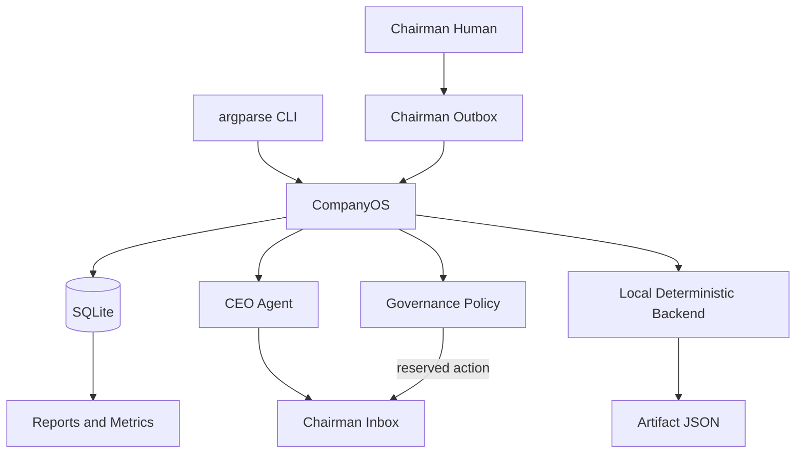

# Architecture

```mermaid
flowchart TD
  CLI[argparse CLI] --> OS[CompanyOS]
  OS --> DB[(SQLite)]
  OS --> GOV[Governance Policy]
  OS --> BE[Local Deterministic Backend]
  OS --> CEO[CEO Agent]
  CEO --> INBOX[Chairman Inbox]
  CHAIR[Chairman Human] --> OUTBOX[Chairman Outbox]
  OUTBOX --> OS
  BE --> ART[Artifact JSON]
  DB --> REPORT[Reports and Metrics]
  GOV -->|reserved action| INBOX
```

All state lives in SQLite except Chairman workflow files and deterministic artifact JSON files.
